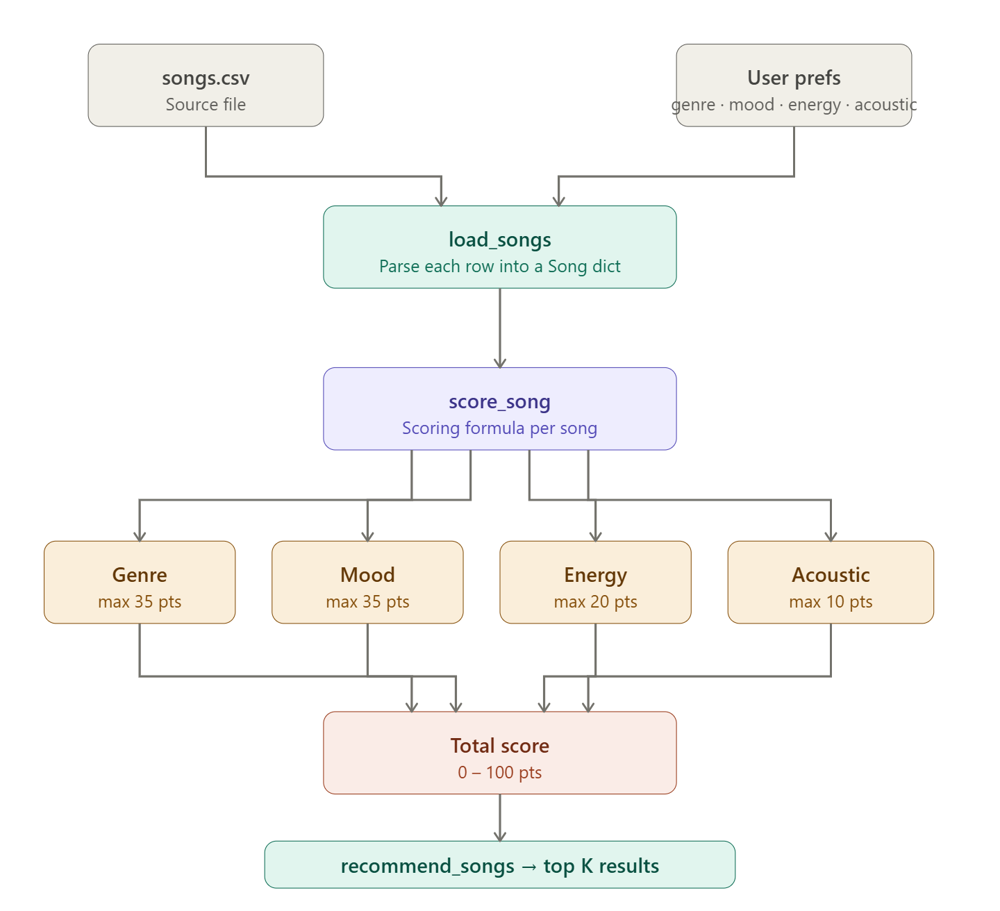
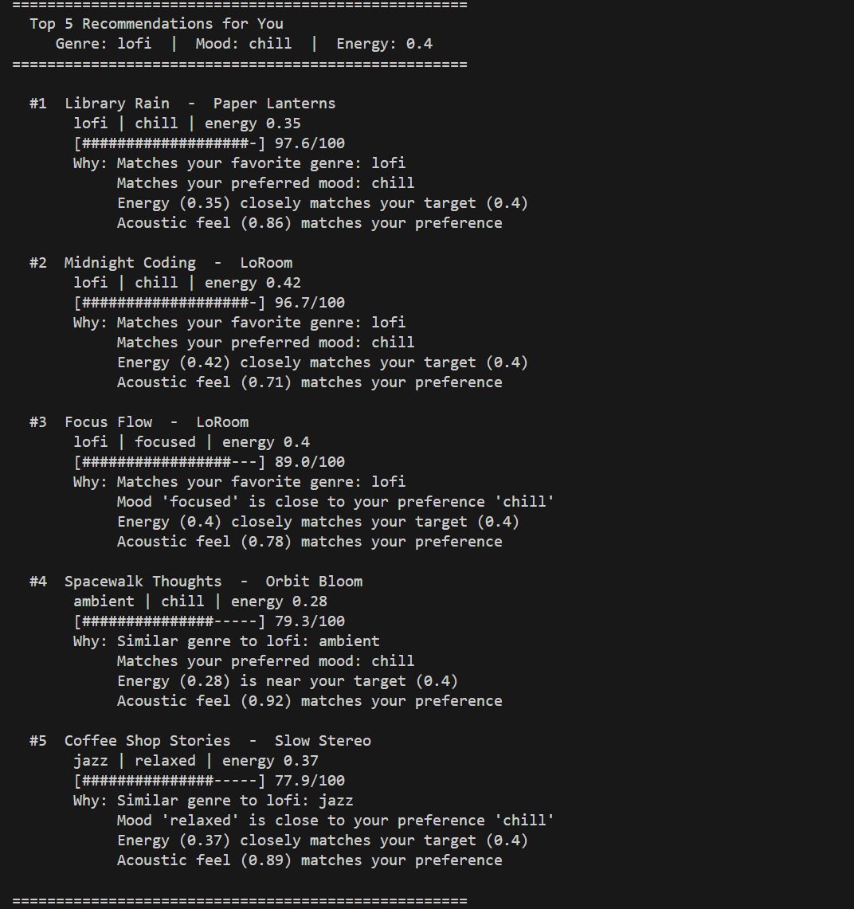

# Music Recommender Simulation

## Project Summary

This project is a small music recommender that scores songs based on a user's taste profile. My version uses genre, mood, energy, and acousticness to rank songs from a small catalog and return the best matches with short explanations. I wanted it to be simple enough to understand clearly, but still realistic enough to show how recommendation systems can shape what people keep seeing.

---

## How the System Works

Real-world recommenders like Spotify match songs to users by turning taste into numbers, comparing audio features like energy and mood against what a user prefers, then ranking by score. This simulation does the same thing on a small scale.

Each song has a `genre`, `mood`, `energy`, and `acousticness`. Each user profile stores a preferred genre, mood, target energy level, and whether they like acoustic music.

### Algorithm Recipe

Every song is scored out of **100 points** using four rules:

| Rule | Points | How It Works |
| --- | --- | --- |
| Genre match | 35 | Exact match = full 35. Same sonic cluster (for example `lofi`, `ambient`, and `jazz`) = 17.5. No relation = 0. |
| Mood match | 35 | Scored on a calm-to-intense scale. Closer moods earn more points; `focused` is near `chill`, while `intense` is far from it. |
| Energy proximity | 20 | `(1 - abs(song.energy - target_energy)) * 20` for a continuous score, not all-or-nothing. |
| Acoustic alignment | 10 | If `likes_acoustic` is `True`: `song.acousticness * 10`. If `False`: `(1 - song.acousticness) * 10`. |

**In plain terms:** a song that matches your genre and mood gets up to 70 points before energy or acoustics are even considered. Energy and acoustic feel then fine-tune the ranking among similar-sounding options.

All songs are scored, sorted highest to lowest, and the top `k` are returned with a plain-language explanation of which rules fired.

### Potential Biases to Watch For

- **Genre dominates.** Genre and mood together make up 70% of the score. A song that perfectly matches the user's energy and acoustic taste but differs in genre will almost always rank below a genre match, even if it would sound great to that listener.
- **Rare genres are disadvantaged.** Genres like `metal`, `classical`, and `blues` appear only once in the catalog. A user who prefers those genres has fewer candidates for partial credit, so their top results may feel less diverse.
- **Acoustic preference is binary.** `likes_acoustic` is `True` or `False`; there is no "sometimes" or "depends on my mood." A user who likes both acoustic and electric tracks will always be steered one way.
- **No listening history.** Every recommendation is based purely on stated preferences, not on what the user has actually skipped or replayed. Real systems update weights based on behavior; this one does not.



### Algorithm Output



---

## Getting Started

### Setup

1. Create a virtual environment if you want to keep dependencies separate:

   ```bash
   python -m venv .venv
   source .venv/bin/activate      # Mac or Linux
   .venv\Scripts\activate         # Windows
   ```

2. Install dependencies:

   ```bash
   pip install -r requirements.txt
   ```

3. Run the app:

   ```bash
   python -m src.main
   ```

### Running Tests

Run the tests with:

```bash
pytest
```

You can add more tests in `tests/test_recommender.py`.

---

## Experiments You Tried

I tested the recommender with several different user profiles to see how the rankings changed.

- A Calm Lofi profile gave strong results like `Library Rain`, `Midnight Coding`, and `Focus Flow`. That made sense because those songs matched the low energy, chill mood, and acoustic preference closely.
- A Happy Pop profile put `Sunrise City` first, which felt right, but it also ranked `Gym Hero` very high. That showed me the model can over-reward the `pop` label even when the overall feeling is more intense than the user probably wanted.
- A High-Energy EDM profile correctly pushed `Drop Zone` to the top. After that, it started mixing in other high-energy songs from nearby styles, which showed me the model is strongest when there is a direct match in the catalog.
- An Acoustic Sad profile had fewer perfect matches, so it pulled songs from `folk`, `classical`, `blues`, and `ambient`. That helped me see that users with more specific or less represented tastes get a thinner set of recommendations.

---

## Limitations and Risks

This recommender only works on a very small catalog, so the results can feel repetitive quickly. It also does not understand lyrics, artist history, or listening context, so it only sees a few simple features. Another limitation is that genre and mood have so much weight that they can overpower more subtle preferences. That is why songs like `Gym Hero` can keep showing up for users who just want softer happy pop.

---

## Reflection

Read and complete [**Model Card**](model_card.md).

This project helped me understand how recommenders turn taste into numbers and then use those numbers to rank choices. Before building it, recommendation systems felt more mysterious to me. After working on this, I could see that even a simple point system can create results that feel personal if it consistently matches a few strong signals.

It also made bias feel more real. The system is not trying to be unfair, but the weights and the dataset still push some users into narrower results than others. If a genre has only one song in the catalog, or if the scoring rewards broad labels too much, some listeners get weaker recommendations without the system ever saying that directly.
